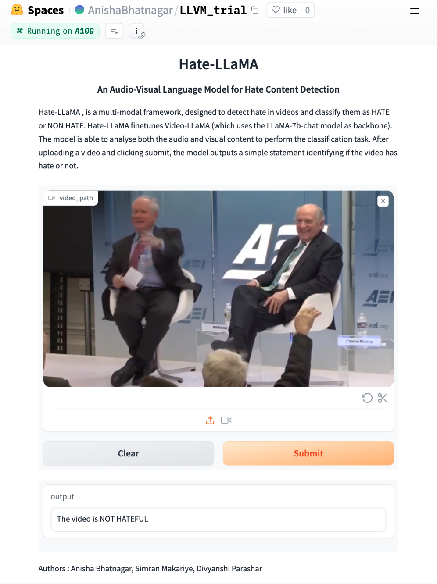

<p align="center" width="100%">
<a target="_blank"></a>
</p>

# Hate-LLaMA : An Instruction-tuned Audio-Visual Language Model for Hate Content Detection

Hate speech detection in online videos is an important but challenging problem, especially with the rise of video-sharing platforms. Existing solutions rely primarily on unimodal models focused on text or image inputs, with less emphasis on multimodal models that analyze both visual and audio aspects of videos. We present Hate-LLama, an instruction-tuned audio-visual language model fine-tuned on a labeled hate speech video dataset named [HateMM](https://github.com/hate-alert/HateMM/tree/main). Hate-LLaMA is a finetuned version of [Video-LLaMA](https://github.com/DAMO-NLP-SG/Video-LLaMA/tree/main). It accepts video input and makes hate speech classifications by analyzing both visual frames and audio in a multimodal fashion. Hate-LLaMA efficiently detects hate content with an accuracy of 71\%.

Another major challenge of hate speech detection on videos is the scarcity of labeled video datasets, hence we also propose a benchmark dataset of around 300 videos consisting of 33\% hate and 67\% non-hate content.

## Examples
<p align="center" width="100%">
<a target="_blank"></a>
</p>

<p align="center" width="100%">
<a target="_blank"></a>
</p>

## Prerequisites
### Environment Setup
```
conda env create -f environment.yml
conda activate hatellama
pip install -r requiremens.txt
```

### Checkpoints and dataset
download and move the checkpoints to ```/ckpt``` folder.

* Download meta-llama/Llama-2-7b-chat-hf from [huggingface](https://huggingface.co/meta-llama/Llama-2-7b-chat-hf).

* Download checkpoints for finetuned audio and video branch Hate-LLaMA and imagebind encoder from [here](https://huggingface.co/spaces/AnishaBhatnagar/LLVM_trial/tree/main/ckpt)

* To download our curated benchmark, [click here](https://drive.google.com/drive/folders/1IyytGuOQ33-VmJMaO3tdwfb5acumGiCC)

* For the HateMM dataset, please [refer](https://github.com/hate-alert/HateMM/tree/main)

## DEMO
To run execute the demo 
```
pip install -r requirements-demo.txt

python3 app.py
```
Executing the demo requires one gpu (preferably RTX8000/A100).

## Finetuning
Adapting the dataset to instruction-tuning format, use ```convert-data.py``` python script.

For pretrained video-llama checkpoints, please [refer](https://huggingface.co/DAMO-NLP-SG/Video-LLaMA-2-7B-Pretrained/tree/main).

To finetune the audio and video branches using these pretrained checkpoints - 

configure the checkpoints and hyperparameters inside the ```audiobranch_stage2_finetune.yaml``` and ```visionbranch_stage2_finetune.yaml```

```
conda activate hatellama

# Finetune the Vision-language branch
torchrun --nproc_per_node=4 train.py --cfg-path  ./train_configs/visionbranch_stage2_finetune.yaml

# Finetune the Audio-language branch
torchrun --nproc_per_node=4 train.py --cfg-path  ./train_configs/audiobranch_stage2_finetune.yaml
```

The finetuning process was done over 4 RTX8000 GPUs.


## Inference
To evaluate the models performance against the test sets : 

```
python inference.py --gpu-id=0 --cfg-path="eval_configs/video_llama_eval_withaudio_stage3.yaml” --ckpt_root="output/"

```

to compute accuracy and F-1 score: 
```
unzip Results.npz
python compute_metrics.py whole_results.npy
```

